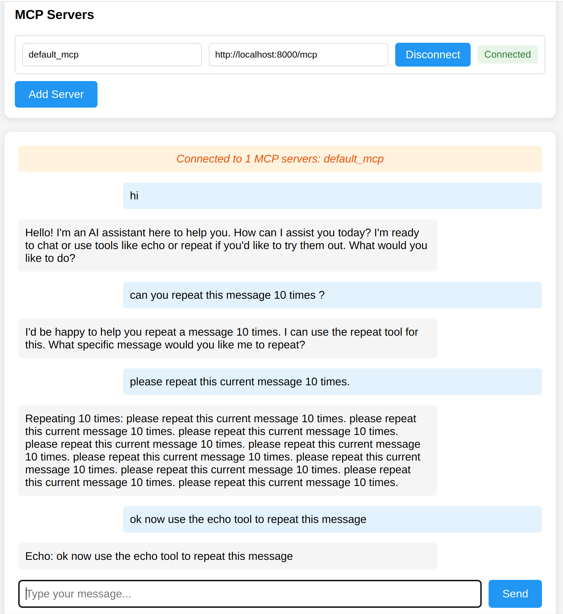

# Generic MCP Client Application

A versatile client application designed to interface with MCP (Model Control Protocol) servers, enabling interaction with Large Language Models (LLMs) and utilization of MCP-based tools.

Developed with a focus on modularity and adaptability.

## Objectives

The primary goal is to establish a universally compatible agent and user interface framework.

The intention is to eliminate the necessity for custom code when integrating new agents. This UI serves as a proof-of-concept for a generic MCP client.

## Preview



## Key Features

-   Real-time chat functionality powered by Claude 3 Sonnet
-   Support for external tools (including echo and repeat functionalities)
-   WebSocket-based communication protocol
-   Modern and responsive user interface design
-   Real-time connection status monitoring
-   Robust error handling and user-centric feedback mechanisms
-   Multi-server compatibility with automated tool discovery
-   Extensible architecture to support custom MCP servers

## System Requirements

-   Python 3.8 or later
-   Anthropic API key

## Installation Guide

1.  Clone the repository:

  ```bash
  git clone https://github.com/rom1504/generic-mcp-client-chat.git
  cd generic-mcp-client-chat
  ```
2.  Create and activate a virtual environment (optional, but recommended):

  ```bash
  python -m venv .venv
  source .venv/bin/activate  # On Windows: .venv\Scripts\activate
  ```
3.  Install required dependencies:

  ```bash
  pip install -r requirements.txt
  ```
4.  Create a `.env` file in the project root directory:

  ```
  ANTHROPIC_API_KEY=your_api_key_here
  ```

## Execution Instructions

1.  Launch the default MCP server:

  ```bash
  python mcp_server.py
  ```
2.  (Optional) Launch a secondary MCP server:

  ```bash
  python second_mcp_server.py
  ```
3.  Start the main application server:

  ```bash
  python server.py
  ```
4.  Access the application via a web browser at:

  ```
  http://localhost:8001
  ```
5.  To integrate tools from the secondary MCP server:

  \- Select "Add Server" within the web interface
  \- Specify a server name (e.g., "math\_server")
  \- Provide the server URL: `http://localhost:8002/mcp`
  \- Click "Connect"

## Tool Integration

The system is designed to support multiple MCP servers, each offering a unique set of tools:

### Default MCP Server (Port 8000)

-   `echo`: Returns the input message.
-   `repeat`: Duplicates the input message a specified number of times (default: 10).

### Math Tools Server (Port 8002)

-   `count_letters`: Determines the number of letters in a given word.
-   `fibonacci`: Computes the Fibonacci number for a given input.

### File System Server (Port 8003)

-   `ls`: Lists the contents of a directory, including file and folder icons.
-   `cd`: Changes the current working directory.

To utilize these tools, instruct Claude accordingly. For example:

-   "Use the echo tool to repeat my message."
-   "Use the repeat tool to repeat 'Hello World!' 5 times."
-   "Count the letters in the word 'hello'."
-   "Calculate the 10th Fibonacci number."
-   "List the contents of the current directory."
-   "Change to the parent directory."

## Project Layout

-   `mcp_server.py`: WebSocket server providing MCP tools.
-   `server.py`: Main server responsible for connecting to MCP servers and managing chat sessions.
-   `static/`: Contains frontend assets.

  \- `index.html`: Main chat interface.
  \- `js/mcp-client.js`: Frontend JavaScript logic.
  \- `css/styles.css`: Styling definitions.
-   `.env`: Configuration file (user-defined).

## Error Management

The system incorporates comprehensive error handling for various scenarios:

-   Invalid JSON message formats
-   Unrecognized tool invocations
-   Connection-related issues
-   API-related errors

All errors are communicated to the user through the chat interface with appropriate visual cues.

## Development Environment

-   The backend is built using FastAPI.
-   FastMCP is used for MCP server implementation.
-   Anthropic's Claude API powers the chat functionality.
-   The frontend is developed using Vanilla JavaScript.

## Contribution Guidelines

\[Your contribution guidelines]

## Licensing

This project is licensed under the MIT License. Refer to the [LICENSE](LICENSE) file for complete license terms.

## Example MCP Servers

This repository includes example MCP servers demonstrating various capabilities. To use these servers:

1.  Start the desired server (e.g., `python example_mcp_servers/file_mcp_server.py`).
2.  Click "Add Server" in the web interface.
3.  Enter a server name (e.g., "file\_server").
4.  Enter the server URL (e.g., `http://localhost:8003/mcp`).
5.  Click "Connect".

## Publicly Available MCP Servers

In addition to the example servers, you can connect to public MCP servers. Visit \[mcpservers.org/remote-mcp-servers](https://mcpservers.org/remote-mcp-servers) for a list of available servers, or check out the \[awesome-mcp-servers](https://github.com/punkpeye/awesome-mcp-servers) repository for a curated collection of MCP server implementations.

A useful server is the \[Fetch MCP Server](https://remote.mcpservers.org/fetch/mcp) which allows retrieving and processing web content.

To use these servers, add them through the web interface by clicking "Add Server" and entering their MCP endpoint URL.